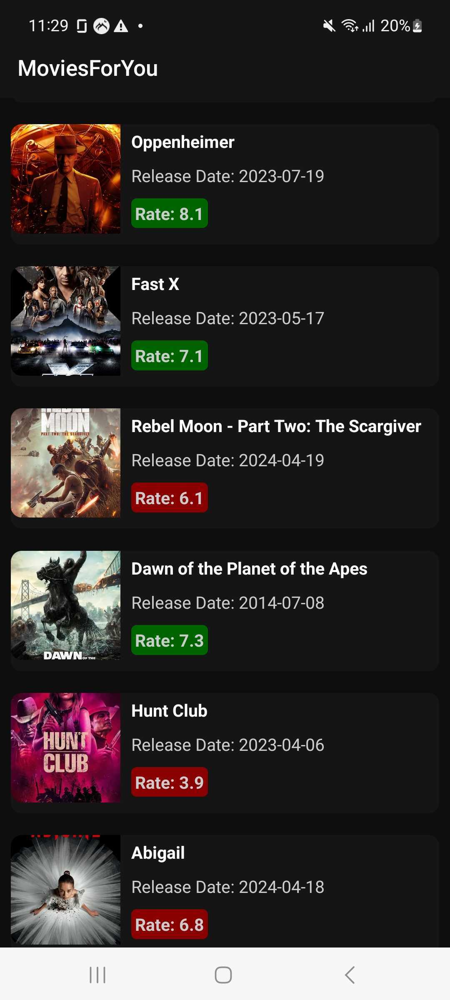
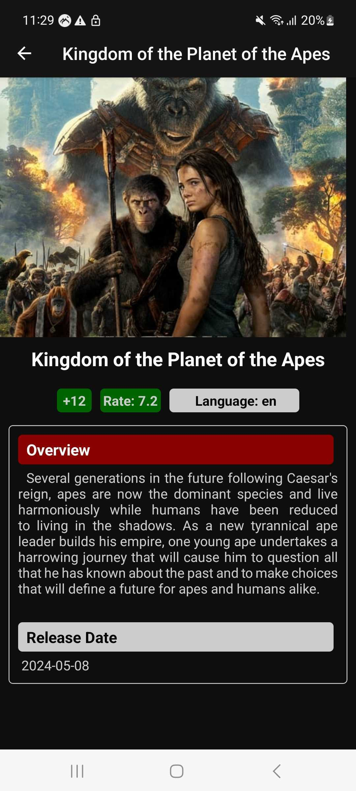
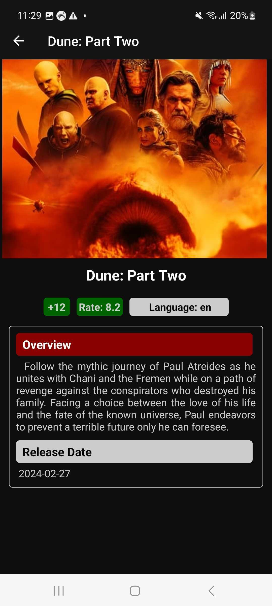
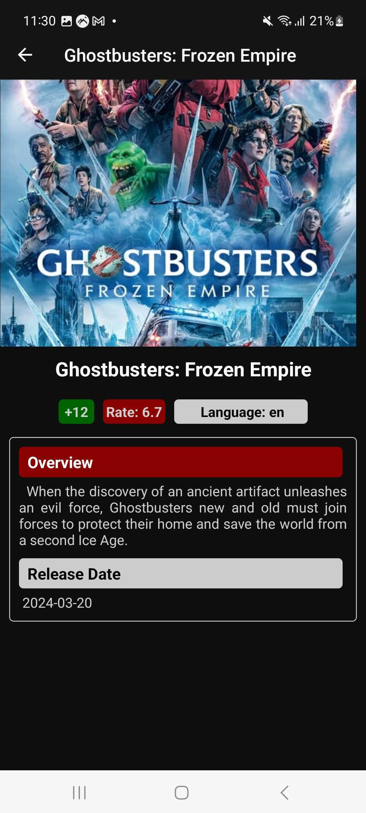

# Movies Listing App

This is a React Native application that lists movies fetched from an  Third party API.

This Mobile App was Implemented by `Mazen Abo ELanin`

## Features

- Fetch and display a list of movies from an Third Party API.
- Display details of each movie, including title, release date, and average vote.
- Pressable movie items to handle movie selection and show more movie details.
- Network calls to the movies API implemented as a
native module.
- App detects if no internet connection and asks user to reconnect


## App Screenshots

### Movies Listing Page

<div>
  
</div>

### Movie Detail Page

  
  
  


## Installation

Before you can run this project, you must have Node.js, npm, and React Native CLI or Expo CLI installed on your machine.

1. Clone this repository:

```bash
git clone <repository-url>
```

2. Navigate into the project directory:

```bash

cd <project-directory>
```

3. Install the dependecies:

```bash
npm install
```


## Running The App

- Run the app on Android Emulator

```bash
npm run android
```


## Future Plan

- Cache Data and Work on Offline Mode